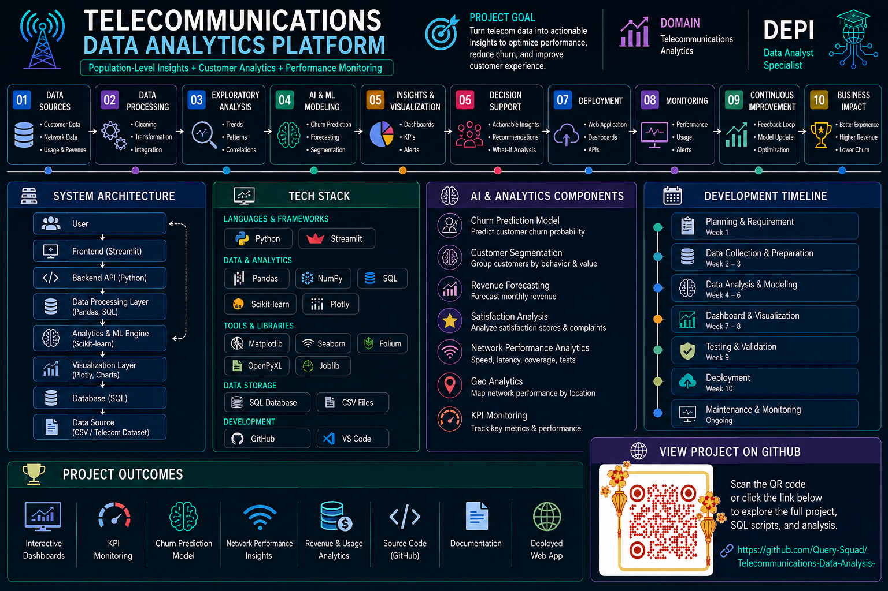

<p align="center">
  
</p>
📡 Egypt Telecom Customer Analytics & Churn Analysis — Full Project Details

**Capstone Project — Digital Egypt Pioneers Initiative (DEPI), Batch 4**
**Track:** Data Analysis | **Tool used across the project:** Excel, SQL Server, Python (Streamlit), Power BI, Tableau Public
**Prepared by:** Eman and Marina

This document describes, in full detail, everything that was built for this project — from the raw data, through cleaning, database design, the interactive Python app, the Power BI report, and the Tableau dashboards — so that anyone reviewing the repo (or grading it) can see exactly what was done and why.

---

## 1. Project Context & Objective

Telecom customer churn (subscribers leaving for a competitor) is one of the most expensive problems an operator faces — it is far cheaper to retain an existing customer than to acquire a new one. This project analyzes a dataset representing Egyptian telecom customers across the four major operators (**Orange, Vodafone, e&, WE**) to answer four core questions:

1. **Who churns, and why?** Which customer segments, operators, and governorates show the highest churn?
2. **Where does revenue come from?** Which operators, plan types, and customer segments generate the most monthly revenue?
3. **Does network quality matter?** Is there a relationship between network performance (download/upload speed, latency) and customer satisfaction or churn?
4. **What early-warning signals exist?** Do complaints and satisfaction scores predict churn before it happens?

To answer these questions thoroughly, the same underlying data was analyzed through **five different tools**, each showing a different angle of the same story — from raw SQL queries to polished interactive dashboards.

---

## 2. The Data

Four datasets sit behind this project:

| Dataset | Rows | What it contains |
|---|---|---|
| `egypt_telecom_dataset-1` (raw) | 5,500 | One row per customer: demographics, plan, usage, revenue, complaints, satisfaction, churn flag |
| `egypt_telecom_calibrated_5000` | 5,000 | A calibrated version of the customer data, purpose-built for churn analysis |
| `tiles_raw` | 965 | Ookla-format network performance measurements (download/upload speed, latency) collected across Egypt in Q4 2024 |
| `gov_summary` | 27 | Network performance metrics aggregated to the governorate level (one row per governorate) |

### Full column list (customer table)
`customer_id`, `operator`, `phone_prefix`, `governorate`, `region` (Urban/Rural), `age`, `age_group`, `gender`, `plan_type` (Prepaid/Postpaid), `customer_segment` (Low/Regular/Business/VIP), `tenure_months`, `network_type` (2G–5G), `data_bundle`, `data_used_GB`, `voice_minutes`, `sms_count`, `monthly_revenue_EGP`, `recharge_frequency`, `device_tier`, `complaints_count`, `satisfaction_score` (1–5), `churn` (0/1), `registration_date`.

---

## 3. Data Cleaning & Preparation — Excel

The raw export was cleaned and validated in Excel before being used anywhere else. Based on inspecting the final cleaned workbook directly, the following is confirmed true of the data:

- **Zero missing values** across all 23 columns, for all 5,500 rows.
- **Zero duplicates** — no repeated `customer_id`, no fully duplicated rows.
- **Categorical fields fully standardized**: `operator` limited to exactly 4 values (Orange, Vodafone, e&, WE); `region` to Urban/Rural; `gender` to Male/Female; `plan_type` to Prepaid/Postpaid; `customer_segment` to 4 tiers (Low, Regular, Business, VIP); `network_type` to 2G through 5G; `device_tier` to 6 categories (from Feature Phone to Tablet).
- **All 27 Egyptian governorates** spelled consistently in Arabic.
- **`age_group` is 100% consistent with `age`** — every single row's age bucket (18-25, 26-35, 36-45, 46-55, 55+) was verified to match the person's actual age.
- **`phone_prefix` maps 1-to-1 with `operator`** (Vodafone → 10, e& → 11, Orange → 12, WE → 15) with no exceptions.
- **Numeric fields are within realistic bounds**: satisfaction score 1–5, churn strictly binary (0/1), complaints 0–5, monthly revenue ≈ 8–2,354 EGP, registration dates between 2022-01-01 and 2024-11-16.
- **`data_bundle`** standardized to exactly 9 named plans (Mini 1GB, Smart 5GB, Super 10GB, Mega 20GB, Unlimited+, Business 10/25/40/Max).

On top of the cleaned base tables, several **pivot-table summary sheets** were built in Excel to sanity-check totals before they were reproduced in SQL/Python/Power BI/Tableau — including revenue by governorate, revenue by operator, and the governorate-level network summary (`gov_summary`) used to seed the SQL database.

---

## 4. Database Design & Analytical Queries — SQL (SQL Server / T-SQL)

A relational database called `EgyptTelecomAnalysis` was built with **three tables**:

### Customers
Primary key `customer_id`. Holds every customer-level field listed in section 2 (operator, governorate, plan, usage, revenue, complaints, satisfaction, churn, etc.). ~5,500 rows.

### NetworkTiles
Primary key `tile_id` (auto-incrementing). Has a **foreign key** on `governorate_en` pointing to `GovernorateSummary`. Holds one row per network measurement tile: download/upload speed, latency, number of tests/devices, and tile coordinates (`tile_lat`, `tile_lon`). ~965 rows.

### GovernorateSummary
Primary key `governorate_en`. Holds the Arabic name (`governorate_ar`), aggregated download/upload speed, latency, total tests, total devices, and tile count for each of the 27 governorates. This table is the **parent** of `NetworkTiles` — it must be seeded first because of the foreign key.

**Customers** links to `GovernorateSummary` informally, by matching the governorate name — this relationship exists in the data but is *not* enforced by a formal foreign key.

📎 See `docs/ERD_Database_Diagram.png` for the visual Entity-Relationship Diagram.

### Repository organization of the SQL script
The original script (schema + ~5,500 rows of seed data + analytical queries, ~7,000 lines in one file) was split into 6 ordered files for the repo so each part is easy to review and run independently — see `sql/00_run_all.sql` through `sql/05_analytical_queries.sql`. Note: seeding order matters — `GovernorateSummary` **must** run before `NetworkTiles`, since the original single-file script had this backwards, which would fail under the declared foreign key.

### What the analytical queries cover (`05_analytical_queries.sql`)
- **Churn analysis** — churn rate broken down by operator, age group, network type, and tenure bucket.
- **Revenue analysis** — top-spending customers, revenue by device tier, total revenue per operator.
- **Usage analysis** — data/voice/SMS usage by age group, identification of high-usage customers, bundle efficiency.
- **Geographic analysis** — churn and satisfaction by governorate, urban vs. rural comparison.
- **Time analysis** — new customer counts and churn trend by registration month, tenure by operator.
- **Advanced joins** — network quality combined with satisfaction and churn, joined at the governorate level.
- **Customer segmentation** — high-value customers, "at-risk" customers (3+ complaints and satisfaction ≤ 2), and operator ranking within each governorate.
- **Row-count / referential-integrity checks** — confirming import counts match expectations and that no `NetworkTiles` row references a non-existent governorate.

---

## 5. Interactive Dashboard — Python (Streamlit + Plotly)

A Streamlit web app (`python/Project_Final_Telecom.py`) was built on top of Pandas and Plotly Express, with **sidebar filters** (operator, governorate, plan type, customer segment) that drive three linked dashboards:

### 📊 Dashboard 1 — Customer & Revenue Overview
- **KPIs:** customer count, average monthly revenue, churn rate, average satisfaction, average tenure.
- **Charts:** revenue by operator, top 10 governorates by customer count, age distribution split by gender, churn rate by customer segment, data usage by bundle, plan-type split.

### 📶 Dashboard 2 — Network Performance by Governorate
- **KPIs:** average download/upload speed, average latency, total tests.
- **Charts:** download speed by governorate, speed-vs-latency scatter plot, geographic map of the 965 measurement tiles.

### ⚠️ Dashboard 3 — Churn Analysis
- **KPIs:** overall churn rate, churned customer count, average complaints and satisfaction (churned vs. retained customers, side by side).
- **Charts:** churn by customer segment, churn vs. complaint count, satisfaction distribution split by churn status, churn by device tier, tenure distribution by churn, churn by e-wallet usage.

**To run it:** `pip install streamlit pandas plotly openpyxl` then `streamlit run python/Project_Final_Telecom.py` (with the cleaned Excel workbook in the same folder).

---

## 6. Business Dashboard — Power BI

The Power BI report (`powerbi/Power_BI_Final_Project.pbix`) has **three report pages**:

### Page 1 — Customers & Revenue Overview
KPI cards: **5.5K customers**, **794.67K EGP** total monthly revenue, **40.78 months** average tenure. Visuals: revenue by governorate (bar), tenure distribution by age group (pie), plan type by customer segment (stacked bar), and revenue share by operator (donut — **Vodafone leads with ~46.7%** of total revenue, followed by Orange ~27.6%, WE ~15.1%, e& ~10.5%).

### Page 2 — Churn Analysis
KPI card: **162 total churned customers (~3% average churn rate)**. Visuals: churn by operator (pie — **Vodafone ~38.9%**, Orange ~27.2%, WE ~20.9%, e& ~13.0% of all churned customers), average churn by tenure (line chart), customer count by satisfaction score and churn status (bar), churn by plan type.

### Page 3 — Usage, Complaints & Network
KPI cards: **5K total complaints**, **3.61 average satisfaction score**, **2M total voice minutes**, **54.45K GB total data used**. Visuals: complaints by governorate (bar), satisfaction by operator, customer count by data bundle, customer count by device tier and network type.

Screenshots of all three pages are embedded directly in `docs/Egypt_Telecom_Project_Documentation.docx`, and saved individually under `screenshots/`.

---

## 7. Exploratory Visual Analysis — Tableau (prepared by Marina)

Two Tableau workbooks were built and published to Tableau Public, covering the same data from a more exploratory, drill-down angle. The full write-up (including a "Key Observations" table and interpretive notes) lives in `docs/Egypt_Telecom_Project_Documentation.docx` (Section 7) and as standalone page images under `screenshots/tableau/`. Summary:

### Workbook 1 — Customer & Revenue Performance (`Tableau_Final_Project.twbx`)
- KPI cards: **794,668 EGP** total monthly revenue, **2.95%** churn rate, **5,500** total customers, **3.6 / 5** average satisfaction, **0.9** average complaints.
- **Vodafone leads monthly revenue by a clear margin**, followed by Orange, then e&, then WE.
- The **Regular** customer segment contributes the most revenue, followed by VIP, then Business, then Low.
- **Prepaid plans generate higher monthly revenue than Postpaid plans** — a pattern consistent with how the Egyptian telecom market operates.
- Revenue by governorate (choropleth map — concentrated around Cairo/Giza/the Delta), and a Data Usage vs. Revenue scatter plot showing **no strong linear relationship** between how much data a customer uses and how much revenue they generate — customer value appears to be driven more by plan type and add-ons than by raw consumption.
- Revenue Trend Over Time (by registration year) shows a decline from ~700K EGP (2022 cohort) to ~100K (2023) to less (2024). **Interpretive note:** this reflects revenue aggregated by *customer registration year*, not an actual multi-year decline in the business — later cohorts simply have fewer customers and/or shorter observed tenure, not necessarily worse performance.

### Workbook 2 — Network Performance (`Tableau_Final_Project_2.twbx`)
- KPI cards: **19.14 Mbps** average download speed, **7.167 Mbps** average upload speed, **65.18 ms** average latency, **1,133,831** total tests.
- **Top 5 governorates by download speed:** Alexandria, Cairo, Giza, Beni Suef, Minya — the most urbanized, well-connected areas.
- **Bottom 5 governorates by download speed:** Red Sea, Matrouh, South Sinai, New Valley, North Sinai — the more remote governorates, which also show the **highest latency** (~80-95 ms vs. ~65-70 ms elsewhere).
- A network speed map of Egypt visualizes this urban/remote gap geographically.

---

## 8. Data Validation & Testing

- Row counts verified after each SQL import (`Customers`, `NetworkTiles`, `GovernorateSummary`) via `COUNT(*)` checks against the expected 5,500 / 965 / 27.
- Referential integrity checked between `NetworkTiles` and `GovernorateSummary` (query for any orphaned governorate references — none found once seeding order was corrected).
- Cross-tool consistency spot-checked: total customer count, total revenue, and churn rate match across the Excel pivots, SQL aggregate queries, the Streamlit app, and Power BI (all report 5,500 customers / ~794.67K EGP / ~3% churn).

---

## 9. Key Insights (across all tools)

1. **Churn is low overall (~3%) but concentrated** — driven by complaint volume and low satisfaction rather than being evenly spread across the customer base.
2. **Vodafone dominates both revenue and churn volume** (~46.7% of revenue, ~38.9% of churned customers) — consistent with it having by far the largest customer base among the four operators.
3. **Complaints are a strong early-warning signal**: customers with 3+ complaints and satisfaction ≤ 2 churn at a visibly higher rate than the rest of the base.
4. **Network quality has a clear urban/remote gap**: governorates like Alexandria, Cairo, and Giza enjoy the fastest speeds and lowest latency, while Red Sea, Matrouh, and the Sinai/New Valley governorates lag on both dimensions — a plausible contributor to lower satisfaction in those areas.
5. **Data usage volume alone does not predict revenue** — plan type and customer segment matter more than how much data a customer actually consumes.
6. **Prepaid customers generate more total revenue than Postpaid customers** in this dataset, despite Postpaid typically being viewed as the higher-value segment in telecom — worth a closer look in any follow-up analysis.

---

## 10. Conclusion & Recommendations

- **Prioritize retention outreach** on the clearest at-risk group in the data: customers with 3+ complaints and a satisfaction score of 2 or below.
- **Investigate network quality** in the lowest-performing governorates (Red Sea, Matrouh, South/North Sinai, New Valley) — the latency gap there is large and plausibly linked to satisfaction and churn risk in those regions.
- **Consider operator-specific retention campaigns**, given how concentrated both revenue and churn are within Vodafone's customer base.
- **Next step:** extend this work with a predictive churn model (e.g., logistic regression or gradient boosting) trained on the calibrated 5,000-record dataset, using complaints, satisfaction, tenure, and network quality as leading features.

---

## 11. Repository Map

```
├── README.md                              # Quick-start overview
├── PROJECT_DETAILS.md                     # This file — full detailed narrative
├── data/
│   └── Project_Telecom_Excel.xlsx
├── sql/
│   ├── 00_run_all.sql
│   ├── 01_schema.sql
│   ├── 02_seed_customers.sql
│   ├── 03_seed_governorate_summary.sql
│   ├── 04_seed_network_tiles.sql
│   └── 05_analytical_queries.sql
├── python/
│   └── Project_Final_Telecom.py
├── powerbi/
│   └── Power_BI_Final_Project.pbix
├── tableau/
│   ├── Tableau_Final_Project.twbx
│   └── Tableau_Final_Project_2.twbx
├── docs/
│   ├── Egypt_Telecom_Project_Documentation.docx
│   └── ERD_Database_Diagram.png
└── screenshots/
    ├── powerbi_customers_revenue.jpg
    ├── powerbi_churn_analysis.jpg
    ├── powerbi_usage_network.jpg
    └── tableau/ (Marina's full Tableau write-up, 8 pages)
```

## 12. Team

- **Data cleaning, SQL, Python, Power BI:** Eman
- **Tableau dashboards & analysis:** Marina
- **Track:** Data Analysis — Digital Egypt Pioneers Initiative, Batch 4
